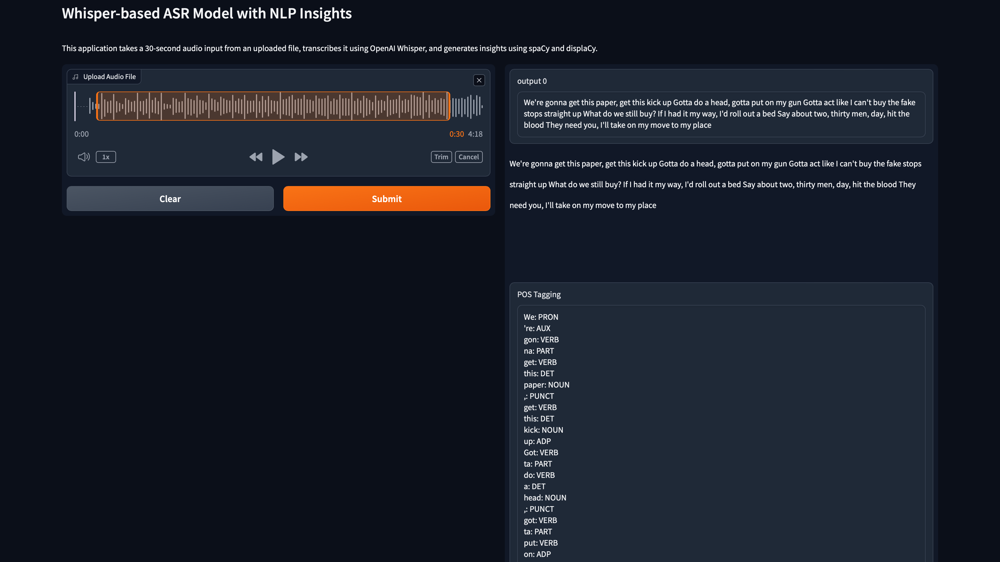

# Whisper-based ASR Model with NLP Insights

This project is a powerful application that combines the capabilities of OpenAI's Whisper model and spaCy's NLP functionalities. It allows you to upload a 30-second audio file, transcribe the speech to text, and generate various natural language processing insights. The project leverages Gradio to create an interactive web interface for easy use.

## Key Features

- **Audio Transcription**: Upload an audio file, and the application transcribes the speech to text using the Whisper model.
- **Named Entity Recognition (NER)**: Identifies and visualizes named entities (such as people, organizations, locations, etc.) in the transcribed text.
- **Part-of-Speech (POS) Tagging**: Tags each word in the transcribed text with its corresponding part of speech (e.g., noun, verb, adjective).
- **Dependency Parsing**: Analyzes the grammatical structure of the transcribed text by establishing relationships between words.
- **Sentence Segmentation**: Splits the transcribed text into individual sentences.

## How It Works

1. **Transcription**:

   - The uploaded audio file is processed and padded/trimmed to fit a 30-second duration.
   - The audio is converted into a log-Mel spectrogram and passed through the Whisper model to generate a transcription.

2. **NLP Analysis**:

   - The transcribed text is analyzed using spaCy.
   - Various NLP insights are generated, including named entity recognition, part-of-speech tagging, dependency parsing, and sentence segmentation.

3. **Display**:
   - The transcribed text and NLP insights are displayed on the web interface using Gradio.

## Usage

To use this application, follow these steps:

1. **Upload an Audio File**: Select an audio file (up to 30 seconds in duration) from your local machine.
2. **View Transcription and Insights**: The application will display the transcribed text along with the following insights:
   - Named Entities Visualization
   - Part-of-Speech Tagging
   - Dependency Parsing
   - Sentence Segmentation

## Installation

To run this project locally, you need to install the required dependencies. Here is the `requirements.txt` file for easy setup:

```plaintext
gradio==3.9
openai-whisper
spacy==3.4.0
pydub==0.25.1
torch==1.12.1
```

### Installation Instructions

1. **Create a virtual environment (optional but recommended)**:

   ```bash
   python -m venv venv
   source venv/bin/activate  # On Windows, use `venv\Scripts\activate`
   ```

2. **Install the requirements**:
   ```bash
   pip install -r requirements.txt
   ```

## Running the Application

To run the application, execute the following command:

```bash
python main.py
```

This will launch the Gradio interface, and you can interact with the application through your web browser.

## Example



---

This project demonstrates the seamless integration of speech recognition and natural language processing, providing valuable insights from audio inputs in an interactive and user-friendly manner.

Feel free to explore and enhance the capabilities of this application according to your needs. Happy coding!

---

This description provides a comprehensive overview of your project, detailing its features, usage, and setup instructions. You can include an example screenshot (`example_screenshot.png`) to visually represent the application's interface.
